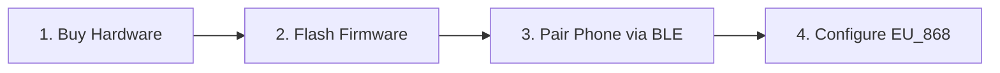

# Getting Started with Meshtastic 🚀

Joining the Armenian Meshtastic mesh requires only a LoRa hardware node and a smartphone.

---

## Step 1. Choose & Buy Hardware

The Armenian community has standardized on **868 MHz (EU_868)**.
The most popular and field-tested hardware options are:
- **Heltec WiFi LoRa 32 (V4)** (~$25): ESP32-S3 with +28 dBm high-power PA, OLED, Wi-Fi, and Bluetooth. Ideal desk gateway and home node.
- **Heltec Mesh Node T114 / LilyGO T-Echo / Wio L1 Pro** (~$30–$55): Nordic nRF52840 low-power handhelds with multi-day battery life for hiking and everyday carry.
- **RAK Wireless WisBlock / Heltec MeshTower** (~$40–$130): Autonomous solar repeaters engineered for rooftops and mountain peaks.

👉 Check out the full [Hardware Selection & Buyer's Guide](/docs/hardware/recommended-devices).

---

## Step 2. Flash Meshtastic Firmware

Modern Meshtastic firmware is flashed directly through your web browser (Chrome or Edge) using the official Web Flasher tool in under 2 minutes. No command-line tools or compilation needed.

👉 Follow the [Flashing Firmware Guide](/docs/getting-started/flashing-firmware).

---

## Step 3. Install App & Pair via Bluetooth

1. Download the official **Meshtastic** app from [Google Play Store](https://play.google.com/store/apps/details?id=com.geeksville.mesh) or [Apple App Store](https://apps.apple.com/us/app/meshtastic/id1586432531).
2. Enable **Bluetooth** on your phone.
3. Open the app, search for nearby Bluetooth devices, and pair with your node.

👉 Follow the [Mobile App Setup Guide](/docs/getting-started/mobile-apps).

---

## Step 4. Apply Armenian Frequency Standards

To connect with the wider Armenian mesh:
- **LoRa Region**: `EU_868`
- **Modem Preset**: `MediumFast`
- **Primary Channel**: Default `MediumFast` (or `Armenia`) with PSK `AQ==`

👉 Read the [Armenia Frequency Standards](/docs/frequencies-and-channels/armenia-standards).
