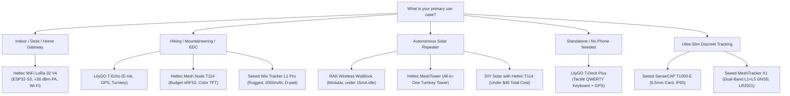

# Meshtastic Hardware Selection & Buyer's Guide (2026)

Joining the Armenian Meshtastic network requires choosing the right LoRa hardware node for your specific mission. Whether you need an ultra-low-power pocket tracker for alpine hiking, an autonomous mountaintop solar repeater, or an indoor desktop gateway, this guide covers community-tested hardware optimized for **Armenia's EU_868 standard**.

:::info Official Armenian Standard: EU_868
Armenia strictly uses the **EU_868** band on **869.525 MHz** (`MediumFast` modem preset). **Never buy 433 MHz hardware**, as its RF filtering circuitry is physically incompatible with the Armenian mesh.
:::

---

## 🧭 1. Quick Decision Guide: Which Node Should You Buy?

---

## ⚡ 2. Core Architectural Choice: ESP32-S3 vs. Nordic nRF52840

The most critical decision when purchasing a node is the microcontroller (MCU) platform:

| Feature | ESP32-S3 (Heltec V4, T-Deck Plus) | Nordic nRF52840 (T114, T-Echo, Wio L1 Pro, T1000-E, MeshTracker X1, RAK4631) |
| :--- | :--- | :--- |
| **Active Power Draw** | High (~80–140 mA active) | Ultra-Low (~5–15 mA active, micro-amps in sleep) |
| **Typical Battery Life** | 8 to 18 hours on 18650 cell | **3 to 7 days** on small battery; weeks with power saving |
| **Wi-Fi Connectivity** | Yes (Built-in Web Client, direct MQTT bridge) | **No** (Bluetooth Low Energy only) |
| **Bluetooth** | BLE 5.0 | BLE 5.0 / 5.4 Long Range |
| **Best Used For** | Plugged-in home nodes, web servers, vehicle dash | **Pocket EDC, hiking, backpack trackers, solar repeaters** |

:::tip Rule of Thumb
- If your node will be **powered by a wall outlet, USB charger, or car 12V socket**, choose **ESP32-S3** for Wi-Fi and web management.
- If your node will **run on battery in your pocket or a solar panel on a roof/mountain**, choose **Nordic nRF52840**.
:::

---

## 📊 3. Master Hardware Comparison Matrix

All devices listed below support **EU_868 (868 MHz)**:

| Device | Platform | LoRa Radio | Display | GNSS (GPS) | Battery & Runtime | Enclosure | Approx. Price | Primary Role |
| :--- | :--- | :--- | :--- | :--- | :--- | :--- | :--- | :--- |
| **Heltec WiFi LoRa 32 V4** | ESP32-S3 | SX1262 + PA (+28dBm) | 0.96″ OLED | Optional | External LiPo (~12 hrs) | Bare / 3D Shell | $22 – $28 | Home Desk / Wi-Fi Gateway |
| **Heltec Mesh Node T114** | nRF52840 | SX1262 (+22dBm) | 1.14″ TFT | Optional | External LiPo (3–5 days) | Bare / 3D Case | $25 – $34 | Budget Pocket Node / EDC |
| **LilyGO T-Echo** | nRF52840 | SX1262 (+22dBm) | 1.54″ E-Ink | Quectel GPS | 850 mAh built-in (3–5 days)| Rugged Turnkey | $55 – $65 | Alpine Hiking / Sunlight EDC |
| **Seeed Wio Tracker L1 Pro** | nRF52840 | SX1262 (+22dBm) | 1.3″ OLED | L76K GPS | 2000 mAh built-in (4–7 days)| Rugged Shell + D-pad | $45 – $55 | Field Communicator |
| **Seeed SenseCAP T1000-E** | nRF52840 | LR1110 (+22dBm) | None (LED) | High-precision | 700 mAh (3–4 days) | 6.5mm Card (IP65) | $35 – $42 | Discreet Pocket/Badge Tracker |
| **Seeed MeshTracker X1** | nRF52840 | Semtech LR2021 | None (Buzzer/LED)| Dual-Band L1+L5 | 1100 mAh (4–5 days) | 8mm Card (IP66) | $45 – $55 | Extreme Precision Trail Tracker |
| **LilyGO T-Deck Plus** | ESP32-S3 | SX1262 (+22dBm) | 2.8″ IPS LCD | Onboard GPS | 2000 mAh (14–20 hrs) | Turnkey QWERTY Case | $60 – $75 | Standalone Phone-Free Texting |
| **RAK Wireless WisBlock** | nRF52840 | SX1262 (+22dBm) | Modular OLED | Optional | Solar / External (under 15mA) | Modular / Unify IP67 | $40 – $70 | Mountaintop Solar Repeater |
| **Heltec MeshTower** | nRF52840 | SX1262 (+22dBm) | None | Integrated GPS | 10W Solar + 3x 18650 bank | Aluminum IP66 Tower | $120 – $150 | Turnkey Rooftop Solar Tower |
| **DIY Solar with T114** | nRF52840 | SX1262 (+22dBm) | Optional | Optional | 5W Solar + 18650 / LiFePO4| IP67 Junction Box | $40 – $50 | Low-Cost Hilltop Repeater |

---

## 📖 4. Deep-Dive Guides

For detailed specifications, teardowns, real-world field impressions, and flashing instructions, visit our dedicated category pages:

- 👉 **[Handheld & EDC Devices Guide](/docs/hardware/handhelds)**: In-depth reviews of the Heltec T114, LilyGO T-Echo, Seeed Wio Tracker L1 Pro, SenseCAP T1000-E, MeshTracker X1, and LilyGO T-Deck Plus.
- 👉 **[Repeaters & Gateways Guide](/docs/hardware/repeaters-and-gateways)**: Complete guide to the Heltec V4 desk gateway, RAK WisBlock modular architecture, Heltec MeshTower, and DIY T114 solar builds.
- 👉 **[Antennas & RF Guide](/docs/hardware/antennas)**: The single most important hardware decision—how to pick tuned 868 MHz whips and mountaintop fiberglass antennas.
- 👉 **[Solar Repeater Engineering](/docs/hardware/solar-repeaters)**: Winter sub-zero thermal engineering, LiFePO4 battery selection, and mountaintop deployment techniques in Armenia.

---

## ⚠️ 5. Critical Traps & Gotchas for Beginners

Before placing your order, avoid these four common pitfalls that damage hardware or degrade performance:

### Trap 1: The Deadly JST Battery Polarity Trap
There is **no universal pinout standard** for small 3.7V LiPo batteries with JST connectors.
- Heltec boards (V3, V4, T114) typically use **JST-GH 1.25mm** connectors with specific polarity.
- RAK Wireless WisBlock and LilyGO boards often use **JST-PH 2.0mm** or 1.25mm with **opposite polarity**.
- **Result of plugging in backwards**: Immediate reverse-voltage destruction of the onboard AXP/TP charging IC or microcontroller.
- **Remedy**: Always verify polarity with a multimeter or visually inspect the `+` and `-` markings silkscreened on the circuit board before plugging in any battery. Swap the red and black pins inside the plastic housing if necessary using a pin needle.

### Trap 2: The Cheap Stock Antenna Pitfall
Up to 70% of stock "rubber ducky" antennas included free in budget board kits are tuned for 915 MHz or 2.4 GHz, not 868 MHz. Running an untuned antenna reflects power back into the transceiver chip (high VSWR), dramatically degrading receive sensitivity and risking PA burnout.
- **Remedy**: Budget $5–$10 to purchase a known, tuned **868 MHz whip antenna** (e.g. Gizont 868MHz, Ebyte, or Linx Technologies).

### Trap 3: Antenna Connector Types (SMA vs. RP-SMA & IPEX vs. MHF4)
- **External Connectors**: Meshtastic devices use standard **SMA** (center pin inside male plug). Do **not** buy **RP-SMA** (Reverse Polarity SMA), which is used for Wi-Fi routers and lacks the center pin connection.
- **Internal Board Connectors**:
  - RAK Wireless and Heltec V3/V4 use **IPEX / U.FL** micro-coaxial connectors.
  - Heltec T114 and certain compact boards use smaller **MHF4** connectors. Verify your connector size before buying pigtail adapters.

### Trap 4: Buying GPS When You Don't Need It
Hardware GPS modules add $10–$15 to device cost and continuously consume 15–30 mA when active.
- Fixed home nodes and mountaintop repeaters **do not need GPS**—their coordinates are set once permanently in the Meshtastic software.
- Portable nodes paired via Bluetooth with your iPhone or Android phone can share your phone's GPS position automatically.
- Only buy onboard hardware GPS if you are building an independent vehicle tracker, an autonomous hiker beacon, or a phone-free standalone node.

---

## 🛒 6. Where to Buy & Shipping to Armenia

Getting Meshtastic hardware delivered to Armenia is straightforward through the following channels:

### 1. Ozon (Fastest Direct Delivery to Armenia)
- **Delivery Time**: 5 to 10 days directly to neighborhood pickup points across Yerevan, Gyumri, Vanadzor, and regional towns.
- **Availability**: Heltec V3/V4, LilyGO T-Echo, T-Beam, and pre-crimped JST LiPo batteries are frequently stocked by sellers on Ozon.
- **Tip**: Always double-check that the listing title or product selection specifies **868 MHz** (not 433 MHz or 915 MHz).

### 2. Official Manufacturer Stores + Freight Forwarders (Onex / Globbing)
Ordering directly from the manufacturers ensures the latest hardware revisions, genuine Semtech chips, and authentic EU_868 RF tuning:
- **[RAKwireless Official Store](https://store.rakwireless.com)**: Best source for WisBlock baseboards (RAK19007, RAK19003), RAK4631 core modules, and Unify outdoor enclosures.
- **[Seeed Studio Official Store](https://www.seeedstudio.com)**: Best source for Wio Tracker L1 Pro, SenseCAP T1000-E, and MeshTracker X1.
- **[Heltec Official Store](https://heltec.org)**: Direct source for Heltec WiFi LoRa 32 V4, Mesh Node T114, and MeshTower.
- **[LilyGO Official Store](https://lilygo.cc)**: Direct source for T-Echo and T-Deck Plus.
- **Logistics**: Ship to your tax-free US, European, or Chinese forwarding warehouse address provided by **Onex** or **Globbing** for fast transit to Armenia.

### 3. Amazon (US / DE via Onex & Globbing)
- Excellent for rapid delivery of accessories: McGill Microwave fiberglass antennas, low-loss LMR-200/LMR-400 coaxial cables, genuine Samsung/Panasonic 18650 and 21700 cells, and weatherproof IP67 polycarbonate enclosures.

### 4. AliExpress Direct & Forwarded
- Broadest selection of components, replacement 868MHz antennas (Gizont, Ebyte), IPEX pigtails, solar panels, and 3D printed case kits.
- Can be delivered directly via **HayPost** (typically 3–5 weeks) or through freight forwarding addresses in China for faster transit.

### 5. Local Armenian Community Stock ([@mesh_am](https://t.me/mesh_am))
- Before ordering abroad, check the **[Meshtastic Armenia Telegram Community (@mesh_am)](https://t.me/mesh_am)**. Community members regularly maintain spare boards, pre-tuned antennas, 3D printed cases, and group order allocations in Yerevan.
