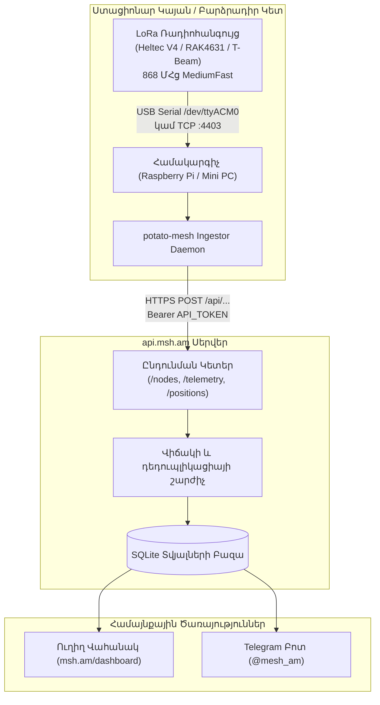

# PotatoMesh Ingester Կարգավորման Ուղեցույց 🥔📡

Meshtastic Armenia համայնքը գործարկում է կրկնակի տվյալների ընդունման համակարգ **`api.msh.am`** հասցեում: Բացի տնային Wi-Fi MQTT դարպասներից, բարձրադիր ռետրանսլյատորները (Արագած, Սևան) և ստացիոնար հանգույցները օգտագործում են **PotatoMesh Ingester** ծրագիրը:

Այս ուղեցույցը բացատրում է, թե ինչպես տեղադրել և աշխատեցնել PotatoMesh Ingester-ը Linux միապլատա համակարգչի (Raspberry Pi, Orange Pi) կամ սերվերի վրա:

---

## 🏛️ Ճարտարապետություն



### PotatoMesh Ingester-ի Առավելությունները

- **Ամբողջական Եթեր**: Որսում է բոլոր տեղական LoRa փաթեթները (ներառյալ առանց MQTT դրոշի), ազդանշանի հզորությունը (SNR, RSSI), հարևան հանգույցները և հետագծերը:
- **Ռադիոյի Թեթևացում**: Ռադիոմոդուլից չի պահանջվում Wi-Fi կամ MQTT պրոտոկոլի աշխատանք, ինչը խնայում է էներգիան և պրոցեսորը:
- **Հարմար է Բարձրադիր Կայանների Համար**: Լավագույն լուծումն է լեռնային ռետրանսլյատորների և ռադիոակումբների համար:

---

## 📋 Նախապայմաններ

1. **Meshtastic Ռադիոսարք**:
   - Ծրագրակազմ՝ **v2.5.0** կամ ավելի նոր:
   - Կարգավորումներ՝ **EU_868**, **MediumFast** (`slot 20`, 869.525 ՄՀց):
2. **Համակարգիչ**:
   - Raspberry Pi, Orange Pi կամ Linux սերվեր (24/7 միացված):
   - Python 3.9+ կամ Docker:
3. **Միացում Ռադիոյին**:
   - **USB մալուխ** (`/dev/ttyACM0` կամ `/dev/ttyUSB0`), **ԿԱՄ**
   - **Ցանցային TCP** (եթե սարքը ձեր LAN ցանցում է `4403` պորտով):
4. **Համայնքային API Թոքեն**:
   - Թոքեն ստանալու համար դիմեք ադմիններին [Telegram Խմբում](https://t.me/mesh_am):

---

## 🚀 Տեղադրում և Կարգավորում (Python / Systemd)

#### 1. Պատճենել Ռեպոզիտորիան

```bash
git clone https://github.com/l5yth/potato-mesh.git /opt/potato-mesh
cd /opt/potato-mesh/data
```

#### 2. Ստեղծել Վիրտուալ Միջավայր

```bash
python3 -m venv .venv
source .venv/bin/activate
pip install meshtastic requests paho-mqtt
```

#### 3. Ստուգել Միացքը և Իրավունքները

```bash
ls -l /dev/ttyACM* /dev/ttyUSB*
sudo usermod -a -G dialout $USER
```

#### 4. Փորձնական Գործարկում

```bash
INSTANCE_DOMAIN="https://api.msh.am" \
API_TOKEN="ՁԵՐ_ՀԱՄԱՅՆՔԱՅԻՆ_ԹՈՔԵՆԸ" \
CONNECTION="/dev/ttyACM0" \
DEBUG=1 \
./mesh.sh
```

#### 5. Systemd Ավտոմատ Ծառայության Կարգավորում

Ստեղծեք `/etc/systemd/system/potatomesh-ingestor.service` ֆայլը.

```ini
[Unit]
Description=PotatoMesh Ingester for api.msh.am
After=network-online.target
Wants=network-online.target

[Service]
Type=simple
User=root
WorkingDirectory=/opt/potato-mesh/data
Environment=INSTANCE_DOMAIN=https://api.msh.am
Environment=API_TOKEN=ՁԵՐ_ՀԱՄԱՅՆՔԱՅԻՆ_ԹՈՔԵՆԸ
Environment=CONNECTION=/dev/ttyACM0
Environment=DEBUG=0
ExecStart=/opt/potato-mesh/data/.venv/bin/python /opt/potato-mesh/data/mesh.py
Restart=always
RestartSec=10

[Install]
WantedBy=multi-user.target
```

Ակտիվացրեք ծառայությունը.

```bash
sudo systemctl daemon-reload
sudo systemctl enable --now potatomesh-ingestor
journalctl -u potatomesh-ingestor -f
```

---

## 🧪 Ստուգում և Դիտարկում

Ստուգեք կապը curl հրամանով.

```bash
curl -i -X POST https://api.msh.am/api/nodes \
  -H "Authorization: Bearer ՁԵՐ_ՀԱՄԱՅՆՔԱՅԻՆ_ԹՈՔԵՆԸ" \
  -H "Content-Type: application/json" \
  -d '{
    "node_id": "!testnode01",
    "short_name": "TEST",
    "long_name": "Ingestor Test",
    "role": "CLIENT"
  }'
```

Այցելեք **[msh.am Ուղիղ Վահանակ](/dashboard)**՝ ձեր ընդունիչի միջոցով լսված հանգույցները տեսնելու համար:

---

## 🤝 Կապ Համայնքի Հետ

- **Telegram Խումբ**: [t.me/mesh_am](https://t.me/mesh_am)
- **msh.am Ուղիղ Վահանակ**: [/dashboard](/dashboard)
- **MQTT Տարբերակ**: [MQTT Դարպասի Ուղեցույց](/docs/frequencies-and-channels/mqtt-settings)
