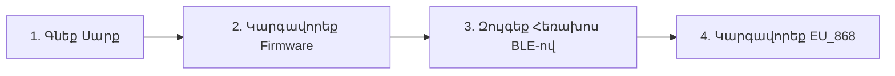

# Սկսելու Meshtastic-ի հետ 🚀

Հայկական Meshtastic mesh-ին միանալու համար պետք է միայն LoRa սարք և սմարտֆոն։

---

## Քայլ 1. Ընտրեք և Գնեք Սարք

Հայկական համայնքը ստանդարտացրել է **868 MHz (EU_868)** հաճախյությունը:
- **Heltec WiFi LoRa 32 (V4)** (~$25): ESP32-S3, +28 dBm PA, OLED, Wi-Fi, Bluetooth։ Իդեալական տնային գեյթվեյ և տնային հանգույց։
- **Heltec Mesh Node T114 / LilyGO T-Echo / Wio L1 Pro** (~$30–$55): Nordic nRF52840 ցածր էներգիա սպառող, բազմօրյա մարտկոցի կյանք։
- **RAK Wireless WisBlock / Heltec MeshTower** (~$40–$130): Ավտոնոմ արեվային հեռանստելներ տանիքների և լեռնագագաթների համար։

👉 Տեսեք լիարժեք [Սարքավորումի Գնման Ուղեցույց](/docs/hardware/recommended-devices)։

---

## Քայլ 2. Meshtastic Firmware-ի Կարգավորում

Նոր Meshtastic firmware-ը կարգավորվում է անմիջապես ձեր բրաուզերի միջոցով (Chrome կամ Edge) պաշտոնական Web Flasher գործիքով 2 րոպեում։

👉 Հետևեք [Firmware Կարգավորման Ուղեցույցին](/docs/getting-started/flashing-firmware)։

---

## Քայլ 3. Տեղադրեք Հավելվածը և Զույգեք Bluetooth-ով

1. Ներբեռնեք **Meshtastic** հավելվածը [Google Play Store](https://play.google.com/store/apps/details?id=com.geeksville.mesh)-ից կամ [Apple App Store](https://apps.apple.com/us/app/meshtastic/id1586432531)-ից։
2. Միացրեք **Bluetooth**-ը ձեր հեռախոսի վրա։
3. Բացեք հավելվածը, գտեք ձեր սարքը և զույգեք։

👉 Հետևեք [Բջջային Հավելվածի Տեղադրման Ուղեցույցին](/docs/getting-started/mobile-apps)։

---

## Քայլ 4. Կիրառեք Հայկական Հաճախյության Ստանդարտները

Հայկական mesh-ին միանալու համար։
- **LoRa Տարածաշրջան**: `EU_868`
- **Մոդեմի Նախադրվածք**: `MediumFast`
- **Հիմնական Ալիք**: Լռածօրյա `MediumFast` (PSK: `AQ==`)

👉 Կարդացեք [Հայաստանի Հաճախյության Ստանդարտները](/docs/frequencies-and-channels/armenia-standards)։
