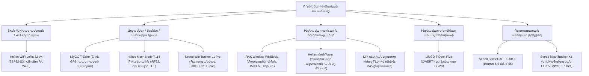

# Meshtastic Սարքավորումների Ընտրություն և Գնման Ուղեցույց (2026)

Հայաստանի Meshtastic ցանցին միանալու համար կարևոր է ճիշտ մոդել ընտրել ձեր առաջադրանքի համար։ Անկախ նրանից, թե ձեզ անհրաժեշտ է գրպանային թրեքեր լեռնային արշավների համար, ինքնավար արևային ռետրանսլյատոր լեռան գագաթին, թե սեղանի տնային դարպաս՝ այս ուղեցույցում ներառված են փորձարկված սարքեր, որոնք օպտիմալացված են **Հայաստանի EU_868 ստանդարտի** համար։

:::info Հայաստանի Պաշտոնական Ստանդարտը՝ EU_868
Հայաստանում խստորեն օգտագործվում է **EU_868** հաճախականությունը՝ **869.525 MHz** (`MediumFast` պրեսետ)։ **Երբեք մի գնեք 433 MHz սարքեր**, քանի որ դրանց ռադիոֆիլտրերը ֆիզիկապես անհամատեղելի են Հայաստանի ցանցի հետ։
:::

---

## 🧭 1. Արագ Ընտրություն. Ինչ Սարք Գնել?

---

## ⚡ 2. Հիմնական Ճարտարապետական Ընտրություն. ESP32-S3 թե՞ Nordic nRF52840

Սարք ընտրելիս գլխավոր գործոնը միկրոկոնտրոլերի հարթակն է.

| Հատկանիշ | ESP32-S3 (Heltec V4, T-Deck Plus) | Nordic nRF52840 (T114, T-Echo, Wio L1 Pro, T1000-E, RAK4631) |
| :--- | :--- | :--- |
| **Հոսանքի Սպառում** | Բարձր (~80–140 մԱ) | Ուլտրացածր (~5–15 մԱ, միկրոամպերներ քնած) |
| **Մարտկոցի Տևողություն** | 8–18 ժամ 18650 տարրից | **3–7 օր** փոքր մարտկոցից, շաբաթներ խնայող ռեժիմում |
| **Wi-Fi** | Այո (ներկառուցված Web-կլիենտ, MQTT կամուրջ)| **Ոչ** (միայն Bluetooth Low Energy) |
| **Bluetooth** | BLE 5.0 | BLE 5.0 / 5.4 Long Range |
| **Լավագույն Կիրառում** | Տնային հանգույցներ, վարդակից սնուցվող սարքեր, ավտոմեքենա | **Գրպանի սարքեր, արշավներ, ուսապարկի թրեքերներ, արևային ռետրանսլյատորներ** |

:::tip Պարզ Կանոն
- Եթե հանգույցը **սնվելու է վարդակից, USB-ից կամ մեքենայի սնուցումից**՝ ընտրեք **ESP32-S3** Wi-Fi-ի և վեբ-ինտերֆեյսի համար։
- Եթե հանգույցը **աշխատելու է մարտկոցով գրպանում կամ արևային վահանակով տանիքին/լեռան վրա**՝ ընտրեք **Nordic nRF52840**։
:::

---

## 📊 3. Սարքավորումների Ամփոփ Աղյուսակ

Բոլոր նշված մոդելները թողարկվում են **EU_868 (868 MHz)** տարբերակով.

| Սարք | Հարթակ | Ռադիոչիպ | Էկրան | GPS | Մարտկոց և Ավտոնոմություն | Իրան | Գին | Հիմնական Դեր |
| :--- | :--- | :--- | :--- | :--- | :--- | :--- | :--- | :--- |
| **Heltec WiFi LoRa 32 V4** | ESP32-S3 | SX1262 + PA (+28dBm) | 0.96″ OLED | Օպցիա | Արտաքին LiPo (~12 ժ) | Սալիկ / 3D տուփ | $22 – $28 | Տնային Wi-Fi դարպաս |
| **Heltec Mesh Node T114** | nRF52840 | SX1262 (+22dBm) | 1.14″ TFT | Օպցիա | Արտաքին LiPo (3–5 օր) | Սալիկ / 3D տուփ | $25 – $34 | Բյուջետային գրպանային հանգույց |
| **LilyGO T-Echo** | nRF52840 | SX1262 (+22dBm) | 1.54″ E-Ink | Quectel GPS | 850 մԱ/ժ (3–5 օր) | Գործարանային | $55 – $65 | Լեռնային արշավներ արևի տակ |
| **Seeed Wio Tracker L1 Pro** | nRF52840 | SX1262 (+22dBm) | 1.3″ OLED | L76K GPS | 2000 մԱ/ժ (4–7 օր) | Պաշտպանված + D-pad | $45 – $55 | Դաշտային հաղորդակից |
| **Seeed SenseCAP T1000-E** | nRF52840 | LR1110 (+22dBm) | Ոչ (LED) | Բարձր ճշգրտություն | 700 մԱ/ժ (3–4 օր) | Քարտ 6.5մմ (IP65) | $35 – $42 | Թաքնված թրեքեր-բեյջ |
| **Seeed MeshTracker X1** | nRF52840 | Semtech LR2021 | Ոչ (Վիբրո) | Dual L1+L5 | 1100 մԱ/ժ (4–5 օր) | Քարտ 8մմ (IP66) | $45 – $55 | Գերճշգրիտ թրեքեր |
| **LilyGO T-Deck Plus** | ESP32-S3 | SX1262 (+22dBm) | 2.8″ IPS | Այո | 2000 մԱ/ժ (14–20 ժ) | Ստեղնաշարով պատյան | $60 – $75 | Ինքնավար մեսենջեր |
| **RAK Wireless WisBlock** | nRF52840 | SX1262 (+22dBm) | Մոդուլային | Օպցիա | Արև / Արտաքին (15 մԱ-ից պակաս) | IP67 Unify | $40 – $70 | Լեռնային ռետրանսլյատոր |
| **Heltec MeshTower** | nRF52840 | SX1262 (+22dBm) | Ոչ | Այո | 10W Վահանակ + 3x 18650 | Ալյումին IP66 | $120 – $150 | Պատրաստի արևային աշտարակ |
| **DIY Heltec T114-ով** | nRF52840 | SX1262 (+22dBm) | Օպցիա | Օպցիա | 5W Վահանակ + LiFePO4 | Տուփ IP67 | $40 – $50 | Էժան ռետրանսլյատոր |

---

## ⚠️ 4. Սկսնակների Տարածված Սխալները

1. **JST Միակցիչների Սխալ Բևեռականությունը**. LiPo մարտկոցների համար միասնական ստանդարտ գոյություն չունի։ Heltec-ի և RAK-ի միակցիչների բևեռականությունը կարող է տարբերվել։ Միշտ ստուգեք մուլտիմետրով կամ սալիկի վրա նշված `+` և `-` նշանները նախքան մարտկոցը միացնելը, որպեսզի չայրեք լիցքավորման կոնտրոլերը։
2. **Կոմպլեկտային Անտեննաները**. Տուփի մեջ եղած անտեննաների մինչև 70%-ը կարգավորված են 915 MHz-ի վրա։ Գնեք ճիշտ կարգավորված 868 MHz անտեննա (Gizont, Ebyte)։
3. **SMA և RP-SMA Միակցիչները**. Meshtastic ցանցերում օգտագործվում է սովորական **SMA** (ասեղով ներսում), այլ ոչ թե համակարգչային Wi-Fi-ի **RP-SMA** միակցիչը։
4. **GPS Գնելը Առանց Անհրաժեշտության**. Տնային կայաններին և անշարժ ռետրանսլյատորներին GPS պետք չէ՝ կոորդինատները ծրագրում նշվում են մեկ անգամ։

---

## 🛒 5. Որտեղից Գնել Առաքմամբ դեպի Հայաստան

1. **Ozon**. Առաքում 5–10 օրում Երևանի և մարզերի տրամադրման կետեր (Heltec V3/V4, LilyGO T-Echo հաճախ լինում են առկա)։ Միշտ ստուգեք, որ վերնագրում նշված լինի **868 MHz**։
2. **Արտադրողների Պաշտոնական Խանութներ (RAKwireless, Seeed Studio, Heltec, LilyGO)**. Պատվիրեք **Onex** կամ **Globbing** պահեստների հասցեներին ԱՄՆ-ում, Եվրոպայում կամ Չինաստանում։
3. **Համայնք [@mesh_am](https://t.me/mesh_am)**. Պատվիրելուց առաջ հարցրեք Telegram չաթում. մասնակիցները հաճախ ունենում են ավելորդ սալիկներ, կարգավորված անտեննաներ և պատրաստի պատյաններ Երևանում։
