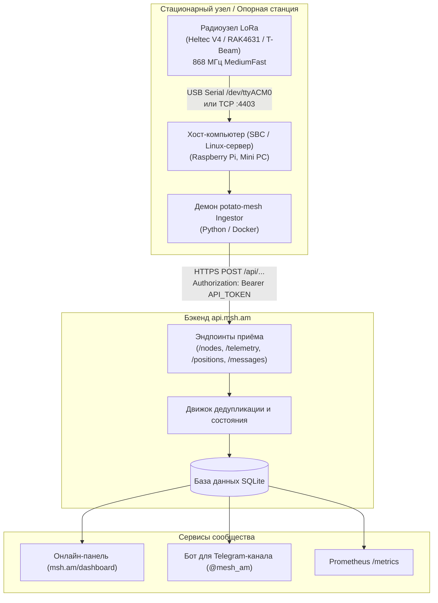

# Настройка PotatoMesh Ingester для api.msh.am 🥔📡

Сообщество Meshtastic Армения использует гибридный бэкенд с двойным приёмом данных (**`api.msh.am`**). Домашние шлюзы могут отправлять пакеты через встроенный MQTT, а опорные узлы, горные ретрансляторы и стационарные базовые станции используют демон **PotatoMesh Ingester**.

В этом руководстве описан процесс установки и настройки PotatoMesh Ingester на одноплатных компьютерах Linux (Raspberry Pi, Orange Pi), домашних серверах или мини-ПК.

---

## 🏛️ Архитектура приёма данных



### Преимущества PotatoMesh перед MQTT

| Характеристика | PotatoMesh Ingester | Встроенный MQTT (`mqtt.msh.am`) |
| :--- | :--- | :--- |
| **Способ подключения** | Физический USB Serial или локальный TCP-сокет | Wi-Fi соединение на самом радиомодуле |
| **Нагрузка на узел** | Нулевая нагрузка Wi-Fi/MQTT на микроконтроллер | Радиомодуль должен постоянно держать Wi-Fi и стек MQTT |
| **Полнота данных** | Фиксирует **все** принятые из эфира пакеты, SNR, RSSI, соседей и трейсы | Только пакеты с флагом `OkToMQTT` |
| **Оптимально для** | Горных ретрансляторов (Арагац, Севан), опорных узлов, радиоклубов | Домашних настольных узлов с надёжным Wi-Fi |
| **Требуемое ПО** | Легковесный Python-демон на хост-компьютере | Не требуется (встроено в прошивку Meshtastic) |

---

## 📋 Предварительные требования

1. **Радиомодуль Meshtastic**:
   - Любое поддерживаемое устройство (Heltec V3/V4, RAK Wireless WisBlock, LilyGO T-Echo, Station G2) с прошивкой Meshtastic **v2.5.0** или новее.
   - Региональные настройки для Армении: **EU_868**, пресет **MediumFast** (`slot 20`, 869.525 МГц).
2. **Хост-компьютер**:
   - Raspberry Pi (3B+, 4B, 5, Zero 2W), Orange Pi, мини-ПК или сервер с Linux, работающий 24/7.
   - Debian / Ubuntu / Raspberry Pi OS / Alpine.
   - Установленный Python 3.9+ или Docker.
3. **Подключение к радиомодулю**:
   - **USB-кабель** для передачи данных (порт `/dev/ttyACM0` или `/dev/ttyUSB0`), **ИЛИ**
   - **Сетевой TCP** (если радиомодуль подключён к вашей локальной сети по Wi-Fi/Ethernet с открытым портом `4403`).
4. **Токен API сообщества**:
   - Для отправки данных в `api.msh.am` требуется токен авторизации (Bearer token).
   - Чтобы получить токен для вашей станции, напишите администраторам в [Telegram-чате сообщества](https://t.me/mesh_am).
   - *(Для локальной разработки используйте тестовый токен `msh_armenia_super_secret_token`)*.

---

## 🚀 Установка и настройка

Рекомендуется использовать стандартный открытый клиент [`potato-mesh`](https://github.com/l5yth/potato-mesh).

### Способ 1: Python и служба Systemd (Рекомендуется)

#### 1. Клонирование репозитория

```bash
git clone https://github.com/l5yth/potato-mesh.git /opt/potato-mesh
cd /opt/potato-mesh/data
```

#### 2. Создание виртуального окружения и установка зависимостей

```bash
python3 -m venv .venv
source .venv/bin/activate
pip install --upgrade pip
pip install -r requirements.txt
```

:::tip Если requirements.txt пуст
Установите необходимые пакеты напрямую:
```bash
pip install meshtastic requests paho-mqtt
```
:::

#### 3. Определение последовательного порта

Подключите радиоустройство по USB и выполните:

```bash
ls -l /dev/ttyACM* /dev/ttyUSB*
```

Обычно устройство доступно как `/dev/ttyACM0` или `/dev/ttyUSB0`. Добавьте текущего пользователя в группу `dialout`:

```bash
sudo usermod -a -G dialout $USER
```
*(Перезайдите в сессию пользователя, чтобы изменения вступили в силу).*

#### 4. Проверка запуска вручную

Запустите тестовый прогон с выводом отладки:

```bash
INSTANCE_DOMAIN="https://api.msh.am" \
API_TOKEN="ВАШ_ТОКЕН_СООБЩЕСТВА" \
CONNECTION="/dev/ttyACM0" \
DEBUG=1 \
./mesh.sh
```

В логах отобразится подключение к устройству, список обнаруженных узлов и успешные ответы `200 OK` от `https://api.msh.am/api/...`.

#### 5. Настройка службы Systemd для автозапуска 24/7

Создайте файл службы:

```bash
sudo nano /etc/systemd/system/potatomesh-ingestor.service
```

Вставьте следующее содержимое:

```ini
[Unit]
Description=PotatoMesh Ingester for api.msh.am
After=network-online.target
Wants=network-online.target

[Service]
Type=simple
User=root
WorkingDirectory=/opt/potato-mesh/data
Environment=INSTANCE_DOMAIN=https://api.msh.am
Environment=API_TOKEN=ВАШ_ТОКЕН_СООБЩЕСТВА
Environment=CONNECTION=/dev/ttyACM0
Environment=DEBUG=0
ExecStart=/opt/potato-mesh/data/.venv/bin/python /opt/potato-mesh/data/mesh.py
Restart=always
RestartSec=10

NoNewPrivileges=true
ProtectSystem=full

[Install]
WantedBy=multi-user.target
```

Активируйте и запустите службу:

```bash
sudo systemctl daemon-reload
sudo systemctl enable --now potatomesh-ingestor
```

Просмотр логов в реальном времени:

```bash
journalctl -u potatomesh-ingestor -f
```

---

### Способ 2: Docker Compose

```yaml
version: '3.8'

services:
  potatomesh-ingestor:
    image: python:3.11-slim
    container_name: potatomesh-ingestor
    restart: unless-stopped
    working_dir: /app
    volumes:
      - /opt/potato-mesh/data:/app
    devices:
      - /dev/ttyACM0:/dev/ttyACM0
    environment:
      - INSTANCE_DOMAIN=https://api.msh.am
      - API_TOKEN=ВАШ_ТОКЕН_СООБЩЕСТВА
      - CONNECTION=/dev/ttyACM0
      - DEBUG=0
    command: >
      sh -c "pip install --no-cache-dir meshtastic requests paho-mqtt &&
             python mesh.py"
```

Запуск:
```bash
docker compose up -d
docker compose logs -f
```

---

## 📻 Рекомендуемые настройки радиоузла

1. **Роль узла (Role)**:
   - **`CLIENT`** или **`CLIENT_MUTE`** для выделенной станции приёма.
   - **`ROUTER`** или **`REPEATER`** для высоких горных точек с широкой зоной покрытия.
2. **Serial Module**:
   - Модуль Serial должен быть включён (по умолчанию активен). Скорость: `115200`.
3. **Регион и канал**:
   - Регион: `EU_868`, основной канал: `MediumFast` (`AQ==`, Slot 0 / 869.525 МГц).
4. **MQTT на радиоузле**:
   - **Оставьте MQTT выключенным (`OFF`)**. Передачу данных выполняет хост через HTTP API.

---

## 🧪 Проверка работы

Выполните тестовый запрос через curl:

```bash
curl -i -X POST https://api.msh.am/api/nodes \
  -H "Authorization: Bearer ВАШ_ТОКЕН_СООБЩЕСТВА" \
  -H "Content-Type: application/json" \
  -d '{
    "node_id": "!testnode01",
    "short_name": "TEST",
    "long_name": "Ingestor Test Node",
    "role": "CLIENT",
    "hw_model": "RAK4631"
  }'
```

Проверьте статус на **[онлайн-панели msh.am](/dashboard)**. Данные от вашего приёмника появятся с пометкой `via PotatoMesh`.

---

## 🤝 Вопросы и контакты

- **Основной Telegram-чат**: [t.me/mesh_am](https://t.me/mesh_am)
- **Онлайн-панель**: [msh.am/dashboard](/dashboard)
- **Репозитории GitHub**: [github.com/msh-am](https://github.com/msh-am)
- **Инструкция по MQTT**: [Настройка MQTT шлюза](/docs/frequencies-and-channels/mqtt-settings)
