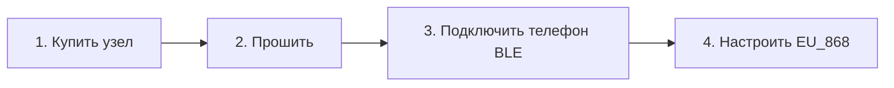

# Начало работы с Meshtastic 🚀

Для подключения к армянской mesh-сети нужен только LoRa-узел и смартфон.

---

## Шаг 1. Выбор и покупка оборудования

Стандарт Армении — **868 MHz (EU_868)**:
- **Heltec WiFi LoRa 32 (V4)** (~$25): Домашняя станция.
- **Heltec T114 / LilyGO T-Echo / Wio L1 Pro** (~$30–$55): Портативные узлы.
- **RAK WisBlock / Heltec MeshTower** (~$40–$130): Солнечные ретрансляторы.

👉 [Полный гид по оборудованию](/docs/hardware/recommended-devices)

---

## Шаг 2. Прошивка

👉 [Руководство по прошивке](/docs/getting-started/flashing-firmware)

---

## Шаг 3. Приложение и Bluetooth

1. Установите **Meshtastic** из [Google Play](https://play.google.com/store/apps/details?id=com.geeksville.mesh) или [App Store](https://apps.apple.com/us/app/meshtastic/id1586432531).
2. Включите **Bluetooth**.
3. Подключите узел в приложении.

👉 [Настройка приложения](/docs/getting-started/mobile-apps)

---

## Шаг 4. Настройка частот

- **Регион**: `EU_868`
- **Пресет**: `MediumFast`
- **Основной канал**: PSK `AQ==`

👉 [Стандарты Армении](/docs/frequencies-and-channels/armenia-standards)
