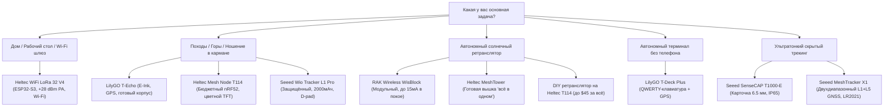

# Выбор оборудования Meshtastic и гид покупателя (2026)

Для подключения к армянской сети Meshtastic важно выбрать подходящую модель под ваши задачи. Нужен ли вам карманный трекер для горных походов, автономный солнечный ретранслятор на вершине горы или настольный домашний шлюз — в этом руководстве собрано проверенное оборудование, оптимизированное под **стандарт Армении EU_868**.

:::info Официальный стандарт Армении: EU_868
В Армении строго используется частота **869.525 МГц** диапазона **EU_868** (пресет `MediumFast`). **Никогда не заказывайте оборудование на 433 МГц**, так как его радиофильтры физически несовместимы с сетью Армении.
:::

---

## 🧭 1. Быстрый выбор: какое устройство купить?

---

## ⚡ 2. Главный архитектурный выбор: ESP32-S3 или Nordic nRF52840

Ключевой фактор при выборе узла — платформа микроконтроллера:

| Характеристика | ESP32-S3 (Heltec V4, T-Deck Plus) | Nordic nRF52840 (T114, T-Echo, Wio L1 Pro, T1000-E, RAK4631) |
| :--- | :--- | :--- |
| **Потребление тока** | Высокое (~80–140 мА) | Ультранизкое (~5–15 мА, микроамперы во сне) |
| **Время от аккумулятора** | 8–18 часов на элементе 18650 | **3–7 дней** на небольшой батарее, недели в эконом-режиме |
| **Wi-Fi** | Есть (встроенный Web-клиент, мост MQTT)| **Нет** (только Bluetooth Low Energy) |
| **Bluetooth** | BLE 5.0 | BLE 5.0 / 5.4 Long Range |
| **Лучшее применение** | Питание от розетки, домашние шлюзы, в авто | **Ношение в кармане, походы, рюкзачные трекеры, солнечные ретрансляторы** |

:::tip Простое правило
- Если узел **будет питаться от розетки, USB-зарядки или прикуривателя авто** — выбирайте **ESP32-S3** ради Wi-Fi и веб-интерфейса.
- Если узел **будет работать от батареи в кармане или от солнечной панели на крыше/горе** — выбирайте **Nordic nRF52840**.
:::

---

## 📊 3. Сводная таблица оборудования

Все указанные модели выпускаются в модификации **EU_868 (868 МГц)**:

| Устройство | Платформа | Радиочип | Экран | GPS | Батарея и автономность | Корпус | Цена | Основная роль |
| :--- | :--- | :--- | :--- | :--- | :--- | :--- | :--- | :--- |
| **Heltec WiFi LoRa 32 V4** | ESP32-S3 | SX1262 + PA (+28dBm) | 0.96″ OLED | Опция | Внешний LiPo (~12 ч) | Плата / 3D-кейс | ~$25 (~9 250 ֏) | Домашний Wi-Fi шлюз |
| **Heltec Mesh Node T114** | nRF52840 | SX1262 (+22dBm) | 1.14″ TFT | Опция | Внешний LiPo (3–5 дней) | Плата / 3D-кейс | ~$30 (~11 000 ֏) | Бюджетный карманный узел |
| **LilyGO T-Echo** | nRF52840 | SX1262 (+22dBm) | 1.54″ E-Ink | Quectel GPS | 850 мАч (3–5 дней) | Заводской кейс | ~$60 (~22 200 ֏) | Горные походы на солнце |
| **Seeed Wio Tracker L1 Pro** | nRF52840 | SX1262 (+22dBm) | 1.3″ OLED | L76K GPS | 2000 мАч (4–7 дней) | Защищённый + D-pad | ~$50 (~18 500 ֏) | Полевой коммуникатор |
| **Seeed SenseCAP T1000-E** | nRF52840 | LR1110 (+22dBm) | Нет (LED) | Высокоточный | 700 мАч (3–4 дня) | Карта 6.5мм (IP65) | ~$39 (~14 400 ֏) | Скрытый трекер-бейдж |
| **Seeed MeshTracker X1** | nRF52840 | Semtech LR2021 | Нет (Вибро) | Dual-Band L1+L5 | 1100 мАч (4–5 дней) | Карта 8мм (IP66) | ~$50 (~18 500 ֏) | Высокоточный трекер |
| **LilyGO T-Deck Plus** | ESP32-S3 | SX1262 (+22dBm) | 2.8″ IPS | Есть | 2000 мАч (14–20 ч) | Корпус с клавиатурой| ~$68 (~25 000 ֏) | Автономный мессенджер |
| **RAK Wireless WisBlock** | nRF52840 | SX1262 (+22dBm) | Модульный | Опция | Солнце / Внешний (менее 15мА)| IP67 Unify | ~$55 (~20 350 ֏) | Горный ретранслятор |
| **Heltec MeshTower** | nRF52840 | SX1262 (+22dBm) | Нет | Есть | 10W Панель + 3x 18650 | Алюминий IP66 | ~$135 (~50 000 ֏) | Готовая солнечная вышка |
| **DIY на Heltec T114** | nRF52840 | SX1262 (+22dBm) | Опция | Опция | 5W Панель + LiFePO4 | Коробка IP67 | ~$45 (~16 650 ֏) | Недорогой ретранслятор |

*Примечание: Цены в драмах (֏) приведены усреднённо из расчёта 1 USD = 370 AMD (без учёта стоимости доставки и возможных пошлин).*

---

## ⚠️ 4. Частые ошибки новичков

1. **Неправильная полярность разъёмов JST**: Единого стандарта распиновки для LiPo аккумуляторов нет. У Heltec и RAK полярность разъёмов может отличаться. Всегда проверяйте мультиметром маркировку `+` и `-` перед подключением батареи во избежание выгорания контроллера заряда.
2. **Штатные антенны**: До 70% бесплатных антенн из комплектов настроены на 915 МГц. Купите настроенную антенну на 868 МГц (Gizont, Ebyte).
3. **Разъёмы SMA и RP-SMA**: В радиосетях Meshtastic применяется обычный разъём **SMA** (штырёк внутри вилки), а не компьютерный Wi-Fi разъём **RP-SMA**.
4. **Покупка GPS без необходимости**: Домашним станциям и стационарным ретрансляторам модуль GPS не нужен — координаты задаются в приложении один раз.

---

## 🛒 5. Где купить с доставкой в Армению

1. **Ozon**: Доставка 5–10 дней в пункты выдачи по Еревану и всей Армении (Heltec V3/V4, LilyGO T-Echo часто бывают в наличии). Всегда проверяйте, чтобы в названии было указано **868 МГц**.
2. **Фирменные магазины (RAKwireless, Seeed Studio, Heltec, LilyGO)**: Заказ на адреса складов **Onex** или **Globbing** в США, Европе или Китае.
3. **Сообщество [@mesh_am](https://t.me/mesh_am)**: Перед заказом спросите в Telegram-чате — у участников часто есть запасные платы, настроенные антенны и готовые корпуса в Ереване.
